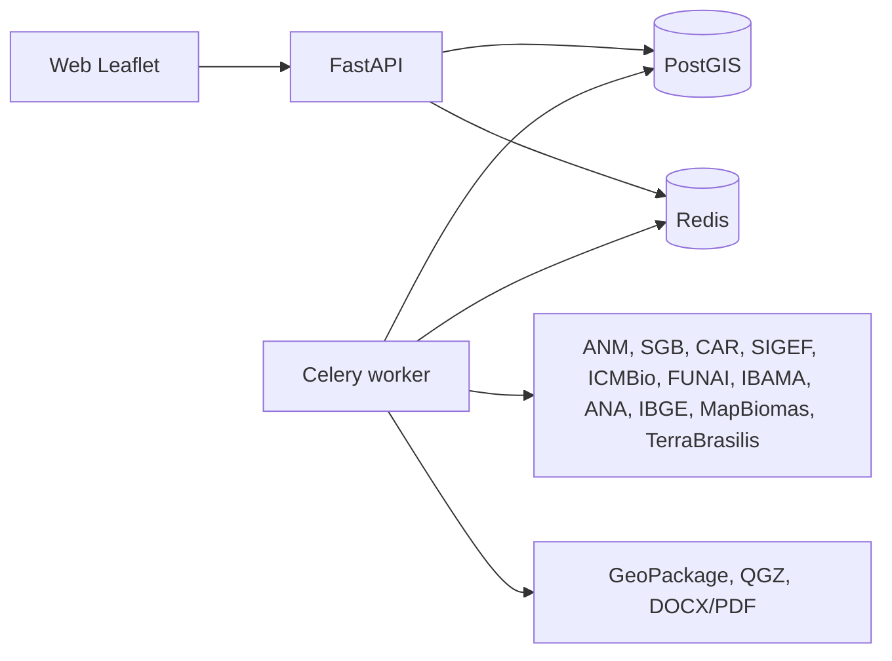

# Plataforma geoespacial mineral, ambiental e fundiária

Aplicação web para receber Áreas de Interesse (AOI), normalizar geometrias em EPSG:4674, calcular áreas em hectares com projeção UTM adequada, armazenar resultados em PostGIS e executar análises de sobreposição contra bases minerais, ambientais, fundiárias, geológicas, hidrológicas e de uso/cobertura.

## Principais recursos

- Upload de AOI em KML, KMZ, SHP/ZIP, GeoJSON ou desenho no mapa.
- Conversão automática para SIRGAS 2000 / EPSG:4674.
- Cálculo de área em hectares por UTM adequada ao centróide da geometria.
- Armazenamento em PostGIS com geometria `MULTIPOLYGON`.
- Catálogo de conectores priorizando WFS, ArcGIS REST, GeoJSON, Shapefile e PostGIS; WMS é tratado como visualização.
- Jobs assíncronos para sincronização de bases, interseções, mapas e relatórios.
- Tabelas de sobreposição com área e percentual por camada.
- Geração de pacote QGIS com GeoPackage, estilos e projeto `.qgz`.
- Geração de relatório DOCX/PDF a partir de templates parametrizados.

## Arquitetura



## Execução local

```bash
cp .env.example .env
docker compose up --build
```

A API estará em `http://localhost:8000` e a interface em `http://localhost:8000/app`.

## Endpoints principais

- `POST /api/projects` cria projeto.
- `POST /api/projects/{project_id}/aoi` recebe AOI multipart ou GeoJSON.
- `POST /api/projects/{project_id}/analysis` agenda interseções.
- `POST /api/sync/{source}` agenda sincronização de uma fonte.
- `POST /api/projects/{project_id}/reports` agenda geração DOCX/PDF e pacote QGIS.
- `GET /api/projects/{project_id}/overlaps` lista sobreposições calculadas.

## Observações

Os conectores trazem implementação operacional para protocolos abertos e um catálogo pronto para as fontes brasileiras solicitadas. URLs e credenciais de portais que mudam com frequência ficam em `backend/app/connectors/catalog.py` e variáveis de ambiente para facilitar manutenção.
